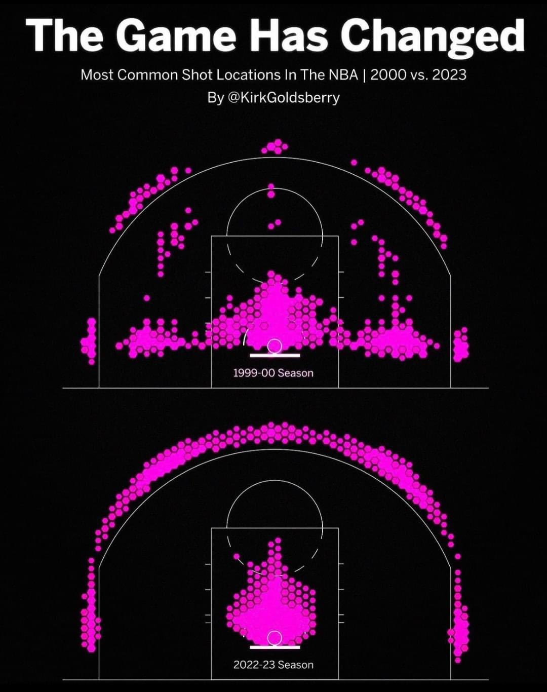
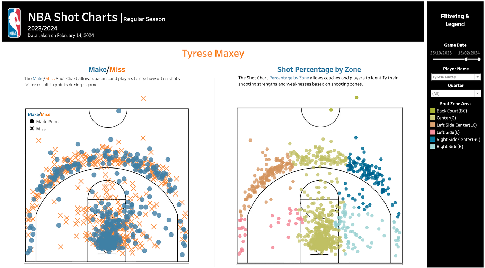
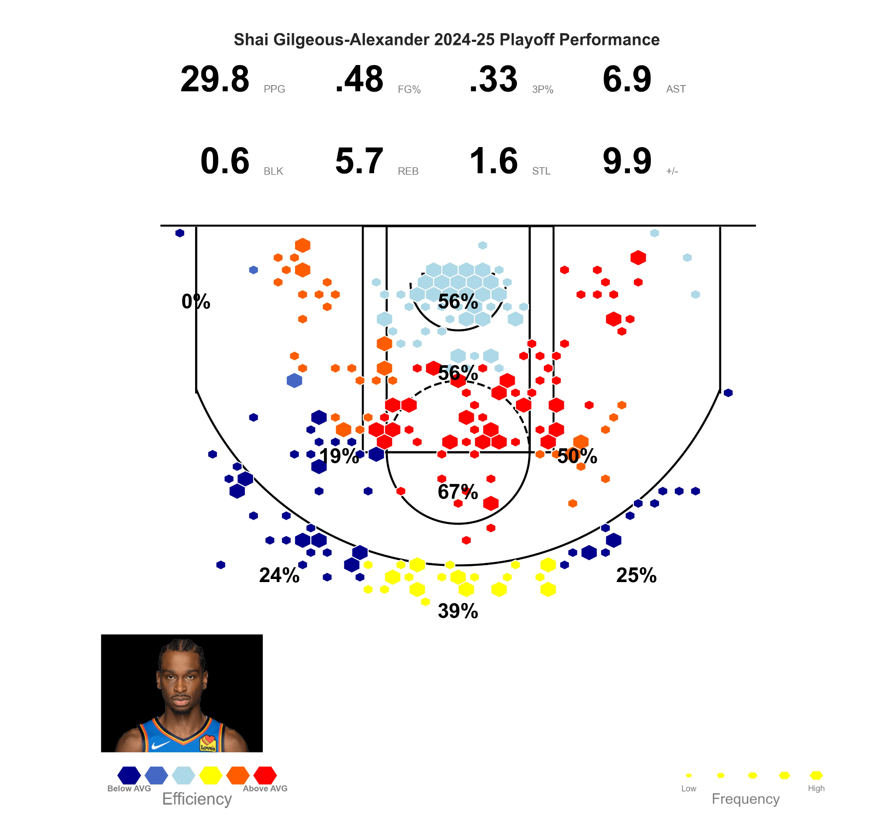

## The Game Has Changed

{width=85%}

::: notes
Basketball analytics has changed shot selection. Teams now emphasize shots near the rim and three-pointers because those are usually more efficient than long midrange shots.
:::

---

## How Teams Track Every Shot

{width=80%}

Systems like **ShotTracker**, **Second Spectrum**, and other tracking tools collect shot-location and player-movement data.

::: notes
 It uses sensors and tracking technology to collect real-time basketball data.
:::

---

## Turning Coordinates Into Shot Charts

{width=90%}

Analysts turn court coordinates into visuals like:

- make/miss charts
- shot zones
- heat maps
- player tendencies

::: notes
Once the data is collected, analysts can plot every shot on the court. This helps coaches see where players are efficient or inefficient.
:::

---

## From Visualization to Strategy

{width=80%}

Shot analytics helps teams decide:

- where players should shoot
- how defenses should guard
- which shots are most valuable

::: notes
The main point is that these visuals are not just pretty graphics. They help teams make strategic decisions.
:::

---

## Main Takeaway

> Basketball analysts use specialized tracking technology to turn every shot into data and that data becomes visual strategy.

::: notes
My takeaway is that sports analytics connects technology, visualization, and decision-making.
:::
